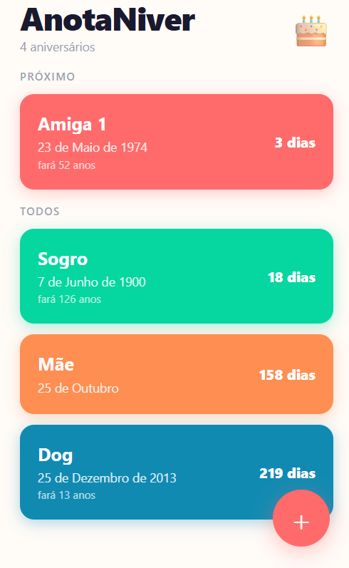
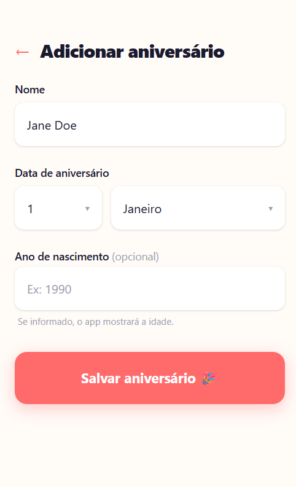

# 🎂 AnotaNiver

**Nunca mais esqueça um aniversário.**

Um app simples, bonito e direto ao ponto — adicione as datas e o app lembra por você.

 

<table>
  <tr>
    <td align="center"><b>Tela principal</b></td>
    <td align="center"><b>Adicionar aniversário</b></td>
  </tr>
  <tr>
    <td></td>
    <td></td>
  </tr>
</table>

---

## ✨ O que ele faz

- **Cards coloridos** com contagem regressiva — "3 dias", "Amanhã!", "Hoje! 🎉"
- **Notificações** no dia do aniversário e na véspera (quando instalado como app)
- **Calcula a idade** automaticamente se você informar o ano de nascimento
- **Funciona offline** — sem internet, sem cadastro, sem conta
- **Instala na tela de início** do celular como um app nativo

---

## Como instalar no celular

### iPhone (iOS 16.4+)

> O app funciona direto no Safari — sem App Store, sem pagar nada.

1. Abra o Safari e acesse **[anota-niver-web.vercel.app](https://anota-niver-web.vercel.app/)**
2. Toque no botão de **Compartilhar** — o ícone de quadrado com seta pra cima, na barra inferior
3. Role a lista e toque em **"Adicionar à Tela de Início"**
4. Confirme o nome e toque em **"Adicionar"**

Pronto. O ícone aparece na sua home screen e o app abre sem barra do Safari, igualzinho a um app baixado da loja.

> **Dica:** Para receber as notificações, permita quando o app pedir acesso — ele vai avisar na véspera e no dia do aniversário.

---

### Android

1. Abra o **Chrome** e acesse **[anota-niver-web.vercel.app](https://anota-niver-web.vercel.app/)**
2. Toque nos **três pontinhos** (menu) no canto superior direito
3. Toque em **"Adicionar à tela inicial"**
4. Confirme e pronto

---

## Como usar

**1. Adicionar um aniversário**
Toque no botão **+** (canto inferior direito), preencha o nome, escolha o dia e o mês. O ano é opcional — se informado, o app mostra quantos anos a pessoa vai fazer.

**2. Ver os próximos aniversários**
A tela principal lista todos em ordem de quem chega primeiro. O primeiro da lista é sempre o mais próximo.

**3. Editar ou remover**
Toque em qualquer card para editar os dados ou remover o aniversário.

---

## Tecnologias

- [React](https://react.dev/) + [TypeScript](https://www.typescriptlang.org/)
- [Vite](https://vite.dev/) + [vite-plugin-pwa](https://vite-pwa-org.netlify.app/)
- [Tailwind CSS](https://tailwindcss.com/)
- Deploy: [Vercel](https://vercel.com/)

Os dados ficam salvos **apenas no seu dispositivo** — nenhuma informação é enviada para servidores.

---

Feito com 🎂 por [Lucas Rafael de Andrade](https://github.com/Andrade020)

